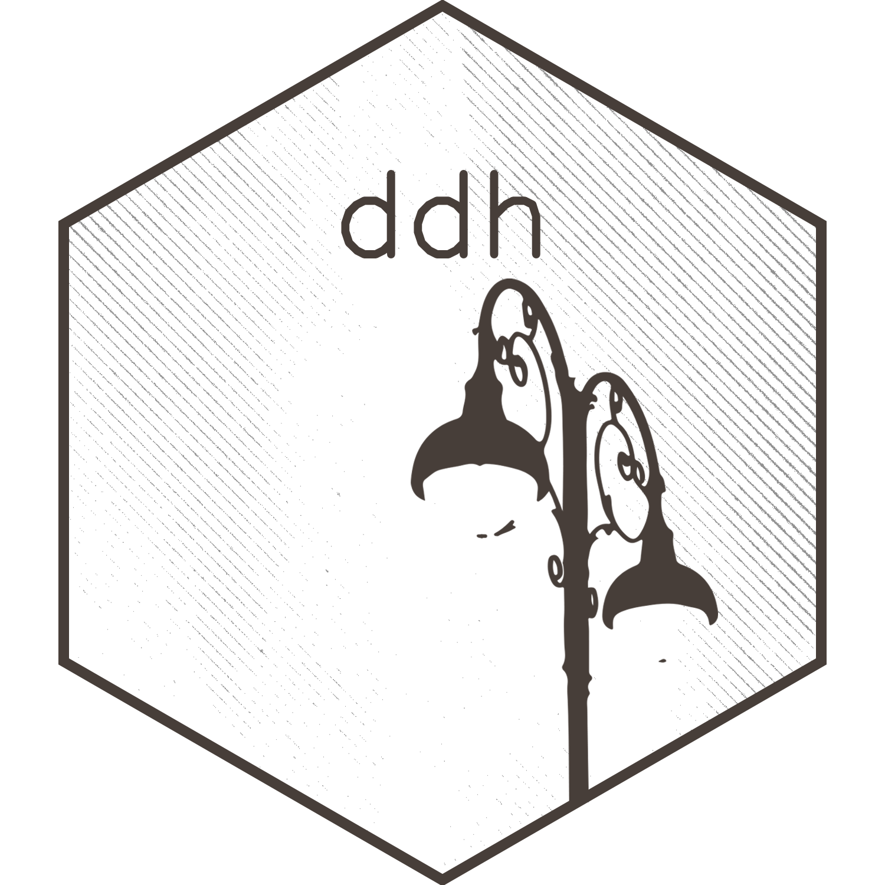

# ddh 

<!-- badges: start -->
[](https://lifecycle.r-lib.org/articles/stages.html#stable)
[](https://github.com/matthewhirschey/ddh/actions/workflows/R-CMD-check.yaml)
<!-- badges: end -->

This package contains functions for data analysis and graphing, data sets, and supporting materials for the [ddh web app](https://www.datadrivenhypothesis.com).

## Installation

```{r, eval = FALSE}
# install.packages("devtools")
devtools::install_github("matthewhirschey/ddh")
```

## Usage

```{r, eval = FALSE}
library(ddh)

# Load DDH data from your local directory
ddh::load_ddh_data(app_data_dir = "xxxx") # path to DDH data dir

# And start using DDH functions!
ddh::make_radial(input = list(content = "ROCK1"))
```

## Citation

Hirschey M. _Making data-driven hypotheses for gene functions by integrating dependency, expression, and literature data_. bioRxiv 2020.07.17.208751; doi: https://doi.org/10.1101/2020.07.17.208751

## Code of Conduct

Please note that the ddh project is released with a [Contributor Code of Conduct](https://contributor-covenant.org/version/2/1/CODE_OF_CONDUCT.html). By contributing to this project, you agree to abide by its terms.
